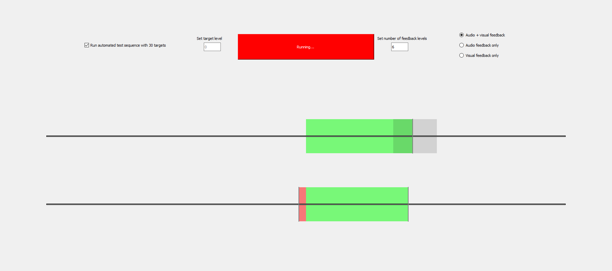

# EMGFeedback

A somewhat messy Python + PyQt5 application for measuring EMG activity from an Arduino platform with electrodes and running closed-loop sensory feedback tests with a number of different sound signal types. 

The tested setup consisted of: 

- An Adafruit Feather M0 connected to a computer through USB serial
- Two Ottobock 13E200 EMG electrodes connected through an Adafruit motor shield to the Feather
- External 7,4V battery for power connected directly to the motor shield and through a voltage converter to the Feather

